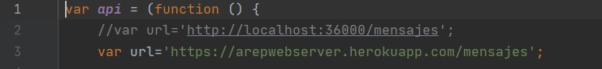
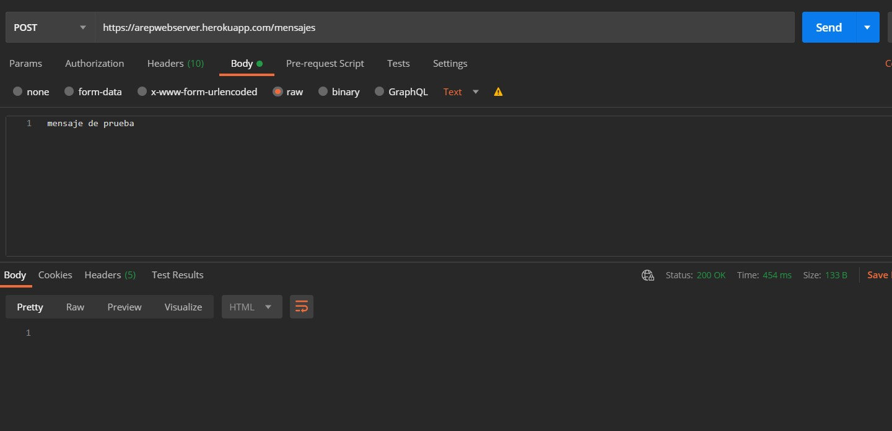
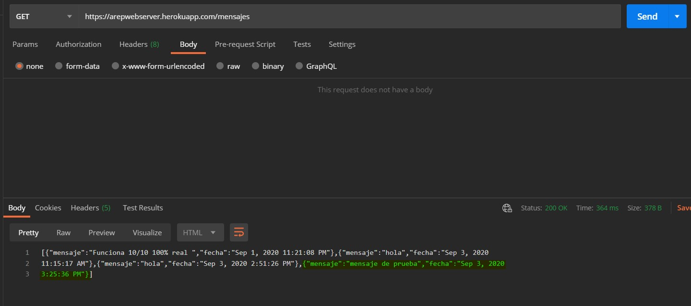

# AREP-WebServer

En este laboratorio se implementa un servidor capaz de 
responder a solicitudes de archivos estáticos como ; imágenes de extension png y jpg, 
archivos de texto de extension js,html y css. Adicionalmente permite la publicación
 y el uso de endpoints de tipo GET y POST utilizando funciones lambda para permitir al usuario
 programar el comportamiento que estos endpoints deben tener, para facilitar el flujo
 de información entre los componentes el servidor también permite que los endpoints
 retornen tipos json, esto debe ser especificado por el usuario.
 
 Para probar el correcto funcionamiento del servidor se implementa una aplicación web
 sencilla que utiliza los servicios del servidor  en la que los usuarios pueden publicar mensaje y ver los mensajes que se han publicado anteriormente
 para la persistencia de los mensajes se utiliza una base de datos MongoDB .
 
 Los detalles de arquitectura se pueden encontrar en el documento de diseño  [Arquitectura.pdf](Arquitectura.pdf)
## Pre-requisitos
* [Maven](https://maven.apache.org/) - Administrador de dependencias
* [Git](https://git-scm.com/) - Sistema de control de versiones
* [Java](https://www.java.com/) - Tecnología para el desarrollo de aplicaciones

## Instrucciones de uso 

Para descargar el proyecto se debe usar 
```
git clone https://github.com/Jcro15/AREP-WebServer
```

Una vez descargado el proyecto este debe compilarse con la siguiente instrucción

```
mvn package 
```

Para ejecutar la aplicación se debe usar el comando 

```
mvn exec:java -D "exec.mainClass"="edu.escuelaing.arep.app.controllers.App"
```
Para usar la aplicación localmente se debe descomentar la linea 2 y comentar la linea 3
en src/main/resources/static/js/app.js 



## Enlace Heroku
  [Despliegue en Heroku](https://arepwebserver.herokuapp.com/)
  
## Pruebas
Para probar la aplicación se pueden publicar nuevos mensajes en la aplicación, esto 
hará un Post seguido de un Get, este comportamiento se puede verificar observando
el comportamiento de la red con las herramientas de desarrollador del navegador.

También se pueden realizar pruebas desde Postman como se ve a continuación
### Test POST



### Test GET


Otros recursos que se pueden consultar son :
* /index.html
* /logoesc.png
* /style.css
* /js/app.js

## Construido con

* [Maven](https://maven.apache.org/) - Administrador de dependencias

## Autor

* **Juan Camilo Rojas Ortiz** - *Estudiante de ingeniería de sistemas* 

## Licencia

Este proyecto esta bajo la licencia GNU(General Public License) los detalles se pueden encontrar en el archivo [LICENSE](LICENSE)

